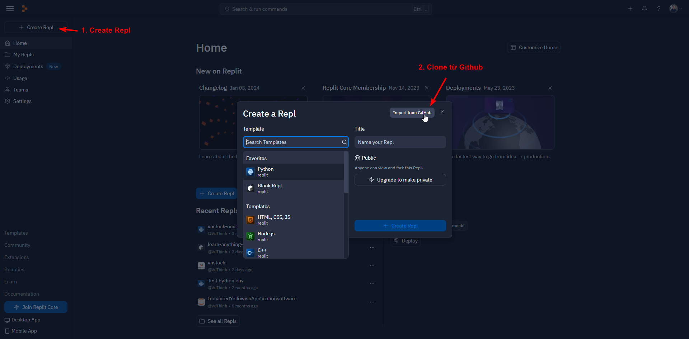
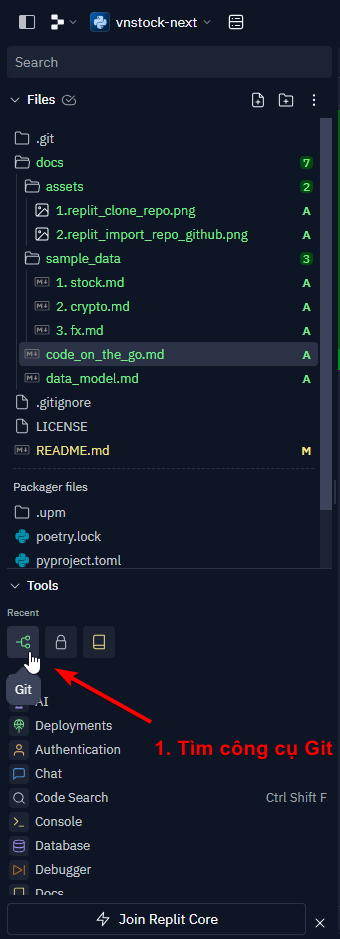
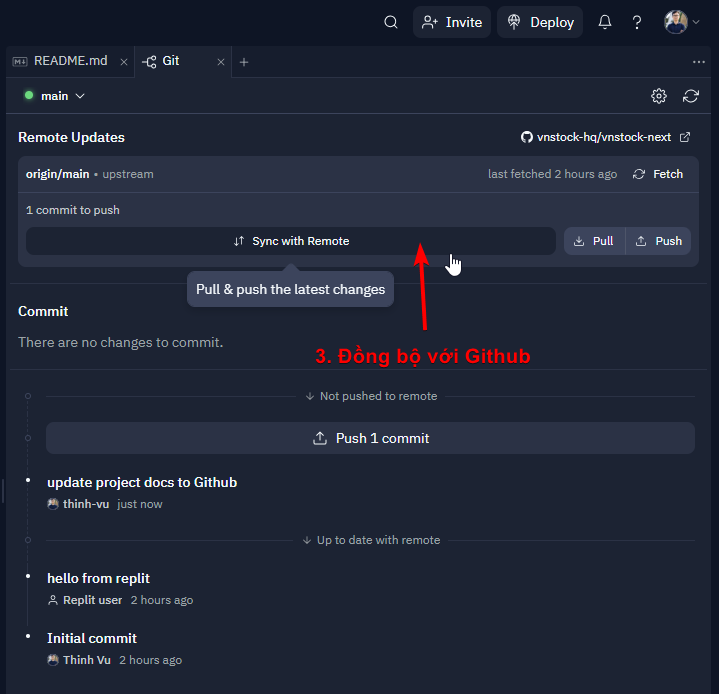

> Sử dụng [Replit](https://replit.com/) để lập trình qua nền tảng web cho public repo kể cả khi sử dụng tablet.

# Folk repo
- Folk repo từ địa chỉ `https://github.com/vnstock-hq/vnstock-next`

# Clone repo từ Github
Các bước thực hiện: 
1. Clone repo: 

2. Paste link repo từ bản folk của bạn vào mục `From URL`

# Commit lên Github
1. Chọn Git từ mục Tools từ sidebar

2. Stage changes

3. Commit

4. Push commits